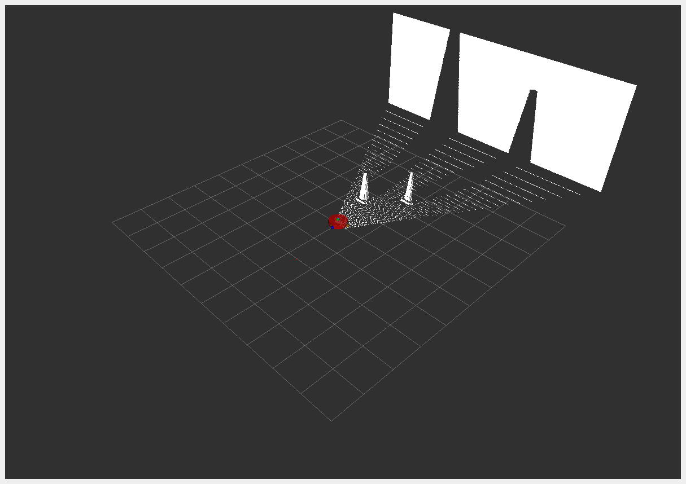

# Mobile Robot Simulation for ROS2 Learning

This repository contains a **mobile robot simulation** designed for understanding the fundamentals of **ROS2** (Robot Operating System 2). The robot features a differential drive system with two powered wheels and a caster wheel for stability, making it perfect for beginners and those looking to learn robot control, sensor integration, and navigation using ROS2.

## Robot Features

The robot is equipped with three essential sensors:

- **LIDAR**: Used for obstacle detection, environment perception, and mapping.
- **Camera**: Provides visual feedback for object detection and recognition.
- **Depth Camera**: Offers depth perception for advanced navigation and obstacle avoidance.

## Project Structure

- **description/**: Contains URDF/XACRO files that define the robot's structure and sensors
  - `robot.urdf.xacro`: Main robot description file
  - `robot_structure.xacro`: Defines the physical structure of the robot
  - `lidar.xacro`, `camera.xacro`, `depth_camera.xacro`: Sensor descriptions
  - `gazebo_control.xacro`: Gazebo control configurations
  - `inertial_macros.xacro`: Inertial property definitions

- **launch/**: Contains launch files for starting the simulation
  - `launch_sim.launch.py`: Main launch file to start Gazebo with the robot
  - `rsp.launch.py`: Robot state publisher configuration

- **worlds/**: Contains Gazebo world definitions
  - `empty.world`: A simple empty world for testing

- **config/**: Contains configuration files for navigation and control

## Prerequisites

To use this package, you need:

1. ROS2 (Humble or later recommended)
2. Gazebo
3. Required ROS2 packages:
   - gazebo_ros
   - robot_state_publisher
   - xacro

## Building the Package

1. Clone this repository into your ROS2 workspace's `src` directory:
   ```bash
   cd ~/ros2_ws/src
   git clone <repository-url> mobile_bot
   ```

2. Build the package:
   ```bash
   cd ~/ros2_ws
   colcon build --packages-select mobile_bot
   ```

3. Source the workspace:
   ```bash
   source /opt/ros/humble/setup.bash
   ```

## Running the Simulation

Launch the robot in Gazebo with:

```bash
ros2 launch mobile_bot launch_sim.launch.py
```

This will start the Gazebo simulator with the robot spawned in an empty world.

## Controlling the Robot

The robot uses a differential drive controller. You can control it using:

```bash
ros2 topic pub /cmd_vel geometry_msgs/msg/Twist "{linear: {x: 0.2, y: 0.0, z: 0.0}, angular: {x: 0.0, y: 0.0, z: 0.1}}"
```

## Visualization in RViz

To visualize sensor data and robot state in RViz:

```bash
ros2 run rviz2 rviz2
```



## Future Development

- Adding navigation stack configuration
- Implementing SLAM capabilities
- Creating more complex world environments
- Adding sensor processing algorithms
